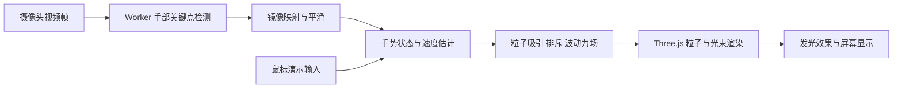

# 指尖光场：摄像头手势控制 3D 光束粒子

状态：第一阶段代码已实现于 `finger-light/`；真实模型与合成视频验证已通过，真人手势和长期性能仍待验。参见 [使用说明](../README.md) 与 [验收记录](第一阶段验收记录.md)。

## 1. 现有目录阅读结论

当前目录中已有 `agent-blueprint/`，是 Agent 产品需求推导蓝图和 Python 组件参考工程。没有发现现成的摄像头、手部识别、Three.js 或粒子渲染实现，也没有前端 package.json。

阅读范围：通读 README、BLUEPRINT、长期需求、入门指南和主要方案内容；按职责查看 17 个组件的说明、源码结构和入口，深入核对最小循环、scaffold、集成循环、工作流及目标闭环入口；检查测试清单、依赖、初始化脚本、CI、编辑器配置，以及 26 张 SVG 架构图的文字结构。其余参考实现按模块和接口浏览，未逐行审计所有函数体。依赖目录、缓存、编译产物和真实 `.env` 不作为产品资料阅读。

| 现有内容 | 结论及本项目用法 |
|---|---|
| `agent-blueprint/README.md`、`BLUEPRINT.md` | 采用需求拆解、最小选型、先方案后代码、明确验收的方法 |
| `agent-blueprint/docs/requirements.md` | 记录的是教学工程分发要求；新项目也采用相对路径、可复现依赖和启动说明 |
| `agent-blueprint/s01_*` 至 `s17_*` | 工具循环、权限、记忆、任务、团队、工作流等 Python 参考；本项目实时链路不直接复用 |
| `agent-blueprint/scaffold/` | 依赖 Anthropic 的 CLI 骨架；不是摄像头或图形应用脚手架 |
| `agent-blueprint/docs/prd-toy-theater.md`、`tools/` | 玩具剧场、家史官、WaveDJ、Talk Town 等其他产品方案；仅参考表达与拆解方法 |
| `agent-blueprint/tests/`、`.github/workflows/test.yml` | 测试针对 Agent 行为；不能用其结果证明手势项目可用 |

核查结果来自文件阅读、全文关键词搜索和 Python AST 结构解析。未运行原工程的模型调用或测试套件；当前副本未发现 Git 仓库元数据。

建议新产品放在同级 `finger-light/`，保留已有蓝图资料。

## 2. 产品目标与第一版范围

打开网页，点击启用摄像头，把手伸进画面，指尖即可牵引深色 3D 空间内的发光粒子束。捏合时粒子收拢，张开时散开，摆动时产生有方向和惯性的涟漪。

已明确需求：摄像头识别手指，操作 3D 光束粒子的分散、聚合、位置与波动。

本方案的默认建议：桌面浏览器优先、单人单手、普通 RGB 摄像头、本地处理视频、暗色青紫光效。手机、双手、声音联动和录像导出列为后续扩展，尚不是用户已确认需求。

第一版交付：完整互动页面、四种核心手势、相对纵深调节、摄像头预览及骨架、识别状态提示、效果参数、鼠标演示模式、质量档位与使用说明。

## 3. 视觉与页面

主体是一束由大量细小发光颗粒构成的空间光流，具备明确的近大远小关系、明亮中心、稀疏外围和运动尾迹。默认缓慢呼吸和流动；手出现后，指尖附近显示轻微光环，帮助用户理解控制中心。

- 聚合：外围颗粒卷向捏合点，形成紧密的光核，保留环绕流动。
- 分散：光核沿空间方向打开，形成颗粒云；不是把整个对象简单放大。
- 牵引：近处粒子先响应，远处粒子随后跟上，形成弯曲光束。
- 波动：摆动沿途产生扩散波前和短暂余振，速度越大，扰动越明显。

页面布局：全屏粒子舞台；左上角名称与模式；右上角启用/关闭摄像头、全屏；左下角可折叠镜像预览；底部手势提示；右侧可收起的灵敏度、粒子密度、波动强度及颜色面板。默认让主要空间留给粒子。

初次打开先展示自动光流，再由用户点击开启摄像头。界面区分模型加载中、等待授权、摄像头就绪、等待手部、正在追踪及故障状态。

## 4. 手势与冲突处理

| 动作 | 画面响应 | 判定与限制 |
|---|---|---|
| 食指伸出并移动 | 控制点跟随指尖，局部光束被牵引 | 使用食指尖坐标；控制方向与镜像预览一致 |
| 拇指与食指捏合 | 粒子向两指中点聚集，捏住后可拖动 | 两指距离除以掌宽归一化；进入与退出使用不同阈值 |
| 张开五指 | 粒子从控制中心向外分散 | 指关节伸展程度和张开程度联合判断 |
| 指尖快速左右或上下摆动 | 沿轨迹产生波纹与方向性冲量 | 由时间归一化速度触发；冷却与幅值上限防止连续爆闪 |
| 手靠近或远离镜头 | 控制点在虚拟空间中前后移动 | 以校准后的掌部表观尺度估计相对变化，限幅并平滑 |
| 手离开画面 | 外力逐渐衰减，粒子回到缓慢流动 | 短暂丢失保留最近位置；持续丢失后进入空闲状态 |

主状态优先级：有效捏合 > 张开分散 > 食指牵引 > 待机。波动是牵引状态的附加效果；捏合拖动时抑制波动触发，防止想聚合却被打散。

起始调参建议：捏合归一化距离小于 0.25 进入，大于 0.35 退出；主状态稳定约 80–120 ms 再切换；波纹冷却约 150 ms；追踪丢失超过约 250 ms 后逐步撤去控制。这些是待真机校准的初值，不是识别精度保证。

通过手指关节夹角判定伸展，避免仅用“指尖是否高于关节”的规则导致手旋转后误判。统一坐标映射，考虑摄像头与视口比例不同造成的裁剪；镜像变换仅应用一次。

普通摄像头不提供精确绝对距离。模型的手部相对深度不能直接作为整只手在房间里的绝对位置；纵深效果采用相对手势映射，并允许用户重新校准。

## 5. 技术选型与架构

建议采用 TypeScript + Vite、Three.js、MediaPipe Hand Landmarker。第一版为浏览器应用，摄像头帧在本地进行推理，不需要 LLM、数据库或业务服务器。

MediaPipe Web 提供 21 个手部关键点，支持视频帧检测；其检测调用会同步阻塞调用线程，因此将识别放入 Worker，并控制同时仅处理一帧。参考：[MediaPipe 官方 Web 指南](https://developers.google.com/edge/mediapipe/solutions/vision/hand_landmarker/web_js)。

Three.js 用于相机、空间坐标与粒子绘制，使用批量粒子几何和自定义着色器，避免为每个粒子创建独立 Mesh。参考：[Three.js 官方文档](https://threejs.org/docs/)。

按蓝图分层方式对应本项目，Agent 编排标记为不适用：

| 层 | 本项目职责与落点 |
|---|---|
| ① 交互层 | 舞台、摄像头预览、手势提示、鼠标输入：`ui/` |
| ② 产品层 | 开始/暂停/关闭、模式切换、参数设置：`app.ts` |
| ③ 编排层 | 确定性手势状态机及动画调度；Agent Loop 不适用：`interaction/` |
| ④ 模型层 | MediaPipe 手部关键点模型：`tracking/hand.worker.ts` |
| ⑤ 能力集成层 | getUserMedia、Worker 通信、Three.js 场景：`camera/`、`rendering/` |
| ⑥ 数据层 | 内存中的关键点与粒子状态；localStorage 仅存效果偏好 |
| ⑦ 基础设施层 | 本地开发服务器、静态构建产物、自托管模型与 WASM |

数据链路：视频帧 → 21 点 → 指尖位置/捏合度/张开度/移动速度 → 统一交互状态 → 每帧更新粒子力场 → 渲染。手势推理与渲染使用独立节奏；渲染在两次识别结果之间插值。

不需要系统提示词、聊天上下文或 Agent 记忆。参数、状态和恢复规则写在确定性代码中。

## 6. 模块契约与粒子行为

| 模块 | 输入 | 输出 | 副作用 |
|---|---|---|---|
| CameraController | 开启/关闭意图、画面规格 | MediaStream、状态和错误 | 启用或释放摄像头，需要浏览器权限 |
| HandTracker | 视频帧、单调时间戳 | 手部关键点、左右手类别、追踪结果 | 本地推理，释放已处理帧 |
| GestureController | 关键点与时间戳 | 模式、控制点、捏合度、移动速度 | 更新内存状态 |
| ParticleField | 交互状态、时间步长 | 粒子位置、速度、亮度 | 更新粒子缓冲区 |
| SceneRenderer | 粒子数据、画质设置 | 3D 画面 | 分配/释放 GPU 资源 |
| SettingsStore | 合法效果参数 | 带版本的参数对象 | 保存本地偏好，不保存视频 |

识别结果契约含 `timestamp`、`hasHand`、关键点及手类别；不把 handedness 分类分数当作每个关键点的可信度。交互结果含 `mode`、`target(x,y,z)`、`pinch`、`openness`、`velocity`、`trackingAge`。

粒子采用基础流场、局部吸引/排斥、沿时间传播的波动力及阻尼共同作用。每个粒子保留位置、速度与独立相位；不直接把所有粒子位置设置到同一个目标点。

更新形式：

`加速度 = 基础流场 + 捏合吸引 + 张开排斥 + 波纹扰动 - 速度阻尼`

吸引力在中心附近软化，避免除零；排斥力随距离衰减；速度和每帧时间步长均设上限。窗口从后台恢复时丢弃过长的时间间隔，防止粒子突然飞离空间。

初版以 TypedArray 粒子状态和批量绘制实现约 8,000–15,000 个粒子，再根据实测决定是否把模拟迁移到 GPU。发光由粒子着色器及可调的 Bloom 后处理共同完成；低画质降低粒子数、像素比及 Bloom 分辨率。

## 7. 性能、隐私与异常

性能预算是待测目标：桌面设备优先争取 60 FPS，识别约 20–30 次/秒；无法维持时降至低画质，争取稳定 30 FPS。先用 640×480 摄像头输入，优先保留交互响应。

Worker 采用最新帧优先：忙时跳过新帧，不形成待处理队列；结果过期则不继续施加旧的手势力。低频刷新文字状态，避免 UI 更新挤占绘制时间。

模型、WASM 和依赖使用锁定版本，模型与运行资源部署到同源路径。首次准备资源可能需要下载；只有资源随应用提供或成功缓存后，才具备对应的离线运行条件。

| 情况 | 产品表现 |
|---|---|
| 用户拒绝摄像头、设备被占用或无摄像头 | 明确原因、提供重试与鼠标演示入口 |
| 模型或 WASM 加载失败 | 显示失败资源类别和重试按钮，保留自动演示 |
| 画面太暗、手被遮挡、暂时出画 | 提示把手放回画面，控制力平滑撤去 |
| Worker 或 GPU 推理初始化失败 | 评估 CPU 低频识别回退；仍不可用则鼠标演示 |
| WebGL 不可用或上下文丢失 | 显示恢复/兼容性提示，不把空白画面伪装成运行中 |
| 关闭摄像头或离开页面 | 停止全部视频轨道、清理 Worker 和图形资源 |

仅申请视频，不申请麦克风；不上传、不录制摄像头帧。关闭预览与关闭摄像头是两个不同按钮状态，隐藏预览不能误报设备已关闭。

网页摄像头需要用户授权及安全上下文。开发使用 localhost，部署使用 HTTPS；不把直接双击 HTML 作为正式启动方式。参考：[MDN getUserMedia](https://developer.mozilla.org/en-US/docs/Web/API/MediaDevices/getUserMedia)。

## 8. 开发顺序与验收

1. **视觉与力场**：搭建空间光束、聚合/分散/波动，并用鼠标验证效果是否可控。
2. **摄像头闭环**：接入模型、Worker、关键点预览与统一坐标映射。
3. **手势手感**：实现归一化、状态优先级、迟滞、平滑、速度限幅及丢手恢复。
4. **完整产品**：补状态提示、质量档位、参数保存、资源自托管和启动文档。
5. **实测**：在真实摄像头和浏览器下检验方向、延迟、稳定性与资源释放。

验收条件：

- 一条开发命令可启动，构建成功；模型和 WASM 没有缺失资源请求。
- 捏合、张开、牵引、波动各重复 10 次，目标至少 9 次符合预期；记录设备与照明条件，不以此宣称通用识别准确率。
- 左右移动符合镜像直觉，窗口大小变化后控制点无明显偏移。
- 捏合边界附近不频繁切换，拖动聚合点不会意外触发强波纹。
- 手离开、重新进入及遮挡恢复时不出现粒子瞬移或数值异常。
- 默认画质连续运行 5 分钟，记录平均 FPS、低帧情况、识别耗时与结果年龄；性能目标未达时调整粒子数并重测。
- 主观感受跟手，并使用高帧率录像抽查动作到画面响应；目标多数操作在 150 ms 内响应，具体数值必须实测。
- 拒绝权限、加载失败和无手场景均有明确出口。
- 点击关闭后视频轨道终止，摄像头不再被此页面占用；通过网络请求检查没有视频上传。

自动化验证针对手势规则与粒子稳定性：用合成关键点覆盖缩放归一化、捏合迟滞、优先级、异常输入和丢失追踪；模拟大时间步长确保粒子坐标有限。摄像头识别与真实手感仍必须人工真机验证。

后续扩展顺序：双手拉伸光场 → 更多形态与配色 → 声音联动 → 画面录制导出。首先完成单手四种交互并确认手感。
